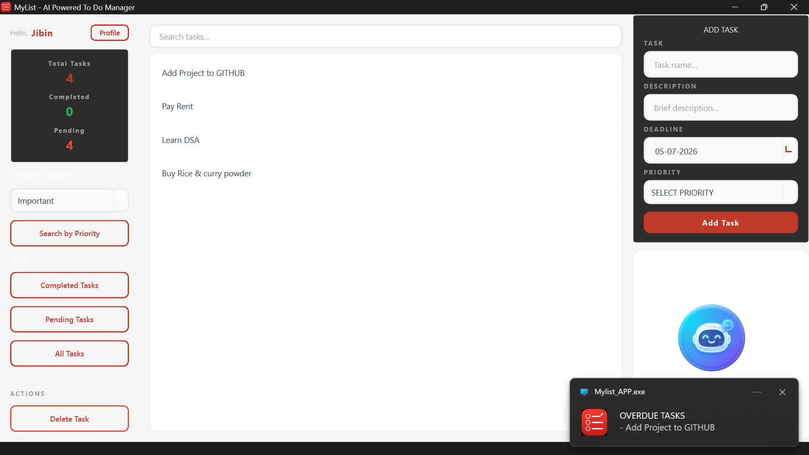
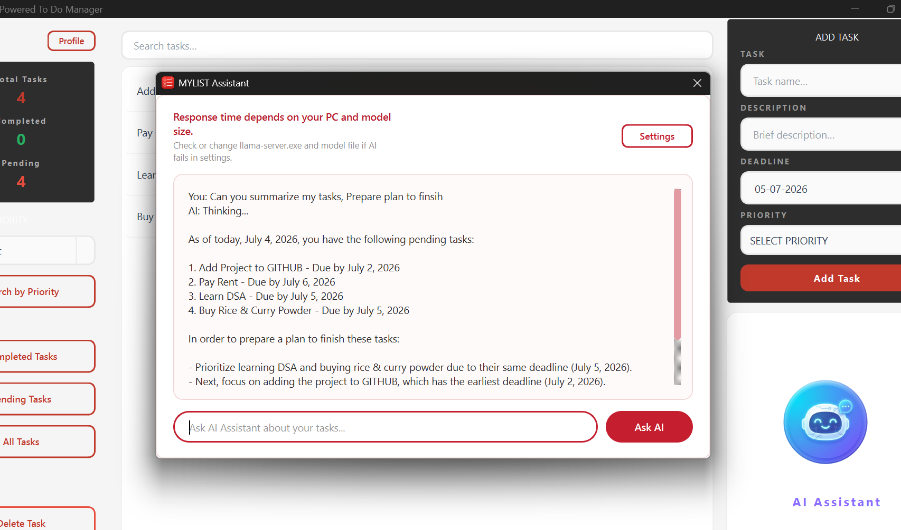
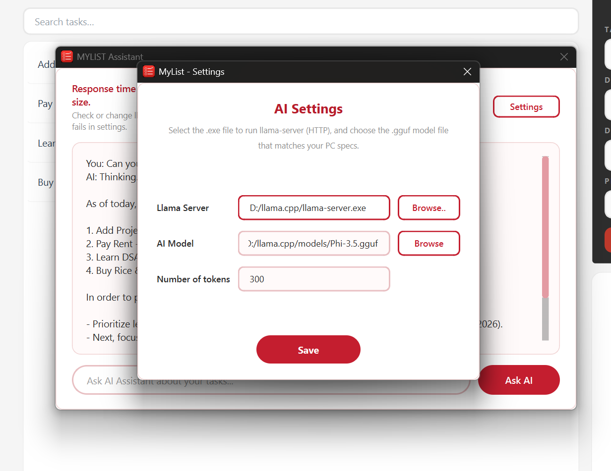
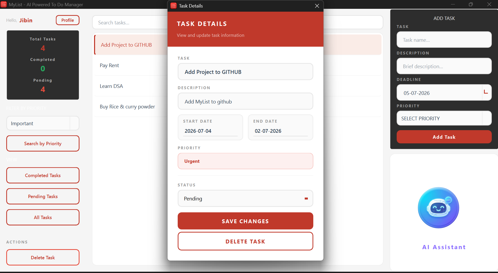

# MyList AI

A desktop productivity app built with **C++** and **Qt**, featuring an integrated **offline AI assistant** powered by **llama.cpp** and **GGUF LLMs** — task management, reminders, and notifications, with a local AI that understands your task list and answers questions about it. No cloud, no internet required.

---

## Screenshots

| Dashboard | AI Assistant |
|---|---|
|  |  |

| AI Settings | Task Details |
|---|---|
|  |  |

---

## Features

**Task Management**
- Create, edit, delete, search tasks
- Pending / completed filtering / Live search
- Priority levels and due dates

**Reminders & Notifications**
- Automatic reminder alerts and deadline tracking
- Native desktop notifications for overdue tasks (`QSystemTrayIcon`), shown even while using the app

**Authentication**
- User registration, login, and session management

**AI Assistant**
- Local, offline LLM that reads your current task list and answers questions about it
- Fetch Tasks from DB -> create prompt (tasks + user question) -> LLM 
- No data leaves your machine

**Export**
- Export all tasks to a TXT file

---

## AI Assistant

The AI Assistant reads your current tasks and answers questions about them using a locally running LLM — no cloud calls.

Example prompts:
- *What are my pending tasks?*
- *Which task should I complete first?*
- *Summarize my current workload.*

**How it works:** your question and current task data (from SQLite) are combined into a structured prompt, sent to a locally running `llama-server` instance, and the response is streamed back into the AI dialog.

```
User question + current tasks
        ↓
  Prompt built (aidialog.cpp)
        ↓
  Sent to AIManager → llama-server (local GGUF model)
        ↓
  JSON response parsed
        ↓
  Displayed in AI dialog
```

The whole exchange is asynchronous (Qt signals/slots), so the UI never freezes while waiting on a response.

### Configurable AI environment

Nothing is hardcoded — users configure their own AI setup from Settings:
- Path to `llama-server.exe`
- Path to any compatible GGUF model
- Maximum response token count

This means MyList AI isn't tied to one model — swap in whatever fits your hardware, no source changes needed. Settings persist across restarts via `QSettings`.

---

## Architecture

The AI system is split into three cooperating modules:

```
aidialog (UI)  ⇄  aimanager  ⇄  appsettings
```

| Module | Responsibility |
|---|---|
| **aidialog.cpp** | UI layer — takes the user's question, pulls current task data from `DatabaseManager`, builds the prompt, sends it to `AIManager`, and displays the response. |
| **aimanager.cpp** | Communication layer — starts `llama-server` (`QProcess`), sends the prompt (`QNetworkRequest`), receives the response (`QNetworkReply`), and parses the JSON (`QJsonDocument`). |
| **appsettings.cpp** | Settings UI — lets users browse for `llama-server.exe` and a GGUF model, set max token count, and persist it all via `QSettings`. |

### Key Qt classes used

| Class | Role |
|---|---|
| `QProcess` | Starts and manages `llama-server.exe` as a separate process |
| `QNetworkAccessManager` / `QNetworkRequest` / `QNetworkReply` | Handles HTTP communication with the local AI server (`/completion`, `/health`) |
| `QJsonDocument` / `QByteArray` | Converts between raw response bytes and JSON |
| `QSettings` | Persists llama-server path, model path, and token limit across restarts |
| Signals & Slots | Keeps the AI request fully asynchronous so the UI never blocks |

---

## Main modules (beyond the AI system)

| File | Responsibility |
|---|---|
| `main.cpp` | Application entry point |
| `mainwindow.cpp` | UI, navigation, task management, reminders, notifications, launches the AI Assistant |
| `authmanager.cpp` | Registration, login, current-user management |
| `taskmanager.cpp` | Task CRUD, search, filtering, statistics |
| `databasemanager.cpp` | SQLite connection, initialization, table creation |
| `taskdetailsdialog.cpp` | Full detail view for a selected task |
| `userprofile.cpp` | User info display and TXT export |

---

## Tech Stack

C++ · Qt Framework · SQLite · Qt Style Sheets (QSS) · CMake · llama.cpp · GGUF models

---

## Project Structure

```text
MYLIST_AI/
├── Forms/
├── Headers/
├── Sources/
├── Styles/
├── icons/
├── resources.qrc
├── CMakeLists.txt
├── README.md
└── .gitignore
```

---

## Future Improvements

- Natural language task creation
- Productivity analytics
- AI-driven calendar planning
- Voice interaction
- Multi-model support
- CRUD operations via AI

---

## Author

**Jibin T George**      
Bachelor of Computer Applications (BCA)                      
PERSONAL PROJECT

Built with C++, Qt Framework, SQLite, and llama.cpp.
